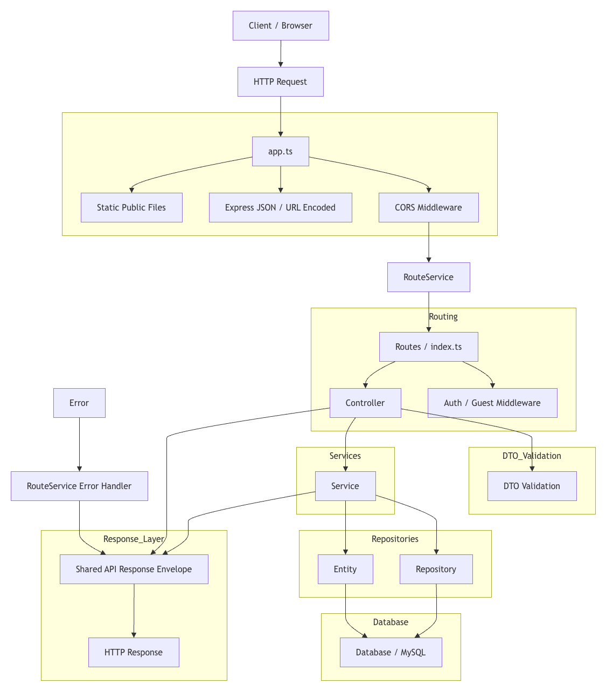

# SmartLocker Backend API

A Node.js/Express backend for the SmartLocker package management system. It uses **TypeScript**, **Express 5**, **TypeORM**, **MySQL**, **JWT-based auth**, **Vitest**, and **tsx** to support a modular API with controllers, middleware, services, repositories, and tests.

## 🎯 Assignment Focus: Design Patterns Implemented

This backend currently applies 7 design patterns and architectural patterns in production code:

1. **Repository Pattern**: encapsulates data access in repository classes for users, stations, lockers, packages, and notifications.
  Reference: [src/database/repositories/BaseRepository.ts](src/database/repositories/BaseRepository.ts), [src/database/repositories/NotificationRepository.ts](src/database/repositories/NotificationRepository.ts)
2. **Service Layer Pattern**: keeps business rules inside services, while controllers stay focused on HTTP flow.
  Reference: [src/services/authService.ts](src/services/authService.ts), [src/services/packageService.ts](src/services/packageService.ts)
3. **Data Transfer Object (DTO) Pattern**: validates and normalizes request payloads before business logic runs.
  Reference: [src/dtos/loginDto.ts](src/dtos/loginDto.ts), [src/dtos/storePackageDto.ts](src/dtos/storePackageDto.ts)
4. **Dependency Injection Pattern**: dependencies are passed through constructors instead of being created inside controllers.
  Reference: [src/controllers/authController.ts](src/controllers/authController.ts), [src/controllers/packageController.ts](src/controllers/packageController.ts)
5. **Composition Root Pattern**: concrete wiring is centralized in src/composition/controllers.ts.
  Reference: [src/composition/controllers.ts](src/composition/controllers.ts)
6. **Interface-Based Design (Ports and Contracts)**: controllers and services depend on interfaces, enabling easier testing and substitution.
  Reference: [src/services/interfaces/AuthServiceInterface.ts](src/services/interfaces/AuthServiceInterface.ts), [src/database/repositories/interfaces/PackageRepositoryInterface.ts](src/database/repositories/interfaces/PackageRepositoryInterface.ts)
7. **Fluent Route Builder Pattern**: route registration uses chained role-aware declarations via routeService and .role([...]).
  Reference: [src/services/routeService.ts](src/services/routeService.ts), [src/routes/route.ts](src/routes/route.ts)

Supporting engineering practices used with these patterns:

- Unit and integration testing with Vitest.
- SOLID principles applied across controller, service, and repository boundaries.
- Layered separation of concerns across route, controller, service, and repository layers.

## 📋 Table of Contents

- [Tech Stack](#-tech-stack)
- [Project Structure](#-project-structure)
- [Path Alias Convention](#-path-alias-convention)
- [Setup & Installation](#-setup--installation)
- [Environment Configuration](#-environment-configuration)
- [Database Migrations](#-database-migrations)
- [Data Seeding](#-data-seeding)
- [Development](#-development)
- [Testing](#-testing)
- [Production](#-production)
- [API Reference](#-api-reference)
- [Architecture](#-architecture)
- [Clean Route Map](#-clean-route-map)
- [Request Lifecycle (End-to-End)](#-request-lifecycle-end-to-end)
- [Next Steps](#-next-steps)

---

## 🏗️ Tech Stack

| Technology | Purpose |
|-----------|---------|
| **Node.js 18+** | Runtime |
| **Express 5** | HTTP server framework |
| **TypeScript / NodeNext** | Type-safe application layer and module resolution |
| **TypeORM** | ORM, entities, and database migrations |
| **MySQL 8** | Relational database |
| **jsonwebtoken** | JWT authentication |
| **bcryptjs** | Password hashing |
| **Vitest** | Unit and integration testing |
| **tsx** | TypeScript execution and watch mode |
| **GitHub Actions** | CI/CD automation |

---

## 📁 Project Structure

```
src/
├── app.ts                           # Express app factory
├── server.ts                        # Server entrypoint
├── composition/                     # Concrete dependency wiring (composition root)
├── controllers/                     # HTTP request handlers
├── dtos/                            # Request validation DTOs 
├── middleware/                      # Auth, guest, CORS, and other middleware
├── routes/                          # Route registration
├── services/                        # Business logic layer
├── utils/                           # Shared response and helper utilities
├── database/
│   ├── data-source.ts               # TypeORM connection config
│   ├── entities/                    # TypeORM entity definitions
│   ├── migrations/                  # Schema evolution files
│   ├── repositories/                # Data access abstractions
│   └── seeders/                     # Data seed scripts
├── tests/                           # Unit and integration tests
└── public/                          # Static assets served by Express

dist/                                # Compiled JavaScript output
tsconfig.json                        # TypeScript compiler configuration
vitest.config.ts                     # Vitest configuration
.github/workflows/                   # GitHub Actions CI/CD workflows
```

---

## � Path Alias Convention

The backend uses the `@` path alias to reference modules from the `src` root. This keeps imports short, explicit, and easy to trace compared with long relative chains like `../../...`.

### Why we use it

- Better project structure and maintainability
- More readable imports in routes, services, and database code
- Easier to follow module ownership and dependencies
- Less brittle when files move around

### Example

Before:

```ts
import authRouter from './auth.js';
import stationsRouter from './stations.js';
import { buildApiResponse } from '../../../utils/response.js';
```

After:

```ts
import authRouter from '@/routes/auth.js';
import stationsRouter from '@/routes/stations.js';
import { buildApiResponse } from '@/utils/response.js';
```

This convention is configured in `tsconfig.json` and should be used consistently across the backend codebase.

---

## �🚀 Setup & Installation

### Prerequisites

- **Node.js** 18+ and **npm** 9+
- **MySQL** 8.0+ running on `localhost:3306`
- MySQL credentials (see `.env.example`)

### Installation

1. **Install dependencies:**
   ```bash
   npm install
   ```

2. **Create `.env` file** (copy from `.env.example`):
   ```bash
   cp .env.example .env
   ```

3. **Update `.env` with your MySQL credentials:**
   ```env
   PORT=3000
   NODE_ENV=development
   DB_HOST=localhost
   DB_PORT=3306
   DB_NAME=smartlocker
   MYSQL_USER=local_user
   MYSQL_PASSWORD=Local-User-DKX-983!
   ```

---

## 🗄️ Environment Configuration

### `.env` Variables

| Variable | Description | Example |
|----------|-------------|---------|
| `PORT` | Express server port | `3000` |
| `NODE_ENV` | Environment mode | `development` or `production` |
| `DB_HOST` | MySQL server hostname | `localhost` |
| `DB_PORT` | MySQL server port | `3306` |
| `DB_NAME` | Database name | `smartlocker` |
| `MYSQL_USER` | MySQL username | `local_user` |
| `MYSQL_PASSWORD` | MySQL password | `Local-User-DKX-983!` |

---

## 🗃️ Database Migrations

### Create Database

If the `smartlocker` database doesn't exist:

```sql
CREATE DATABASE smartlocker CHARACTER SET utf8mb4 COLLATE utf8mb4_unicode_ci;
```

### Run Initial Migration

Applies the schema (tables, enums, indexes, foreign keys):

```bash
npm run db:migrate
```

This runs the migration at `src/database/migrations/1687516800000-InitSmartLockerErd.ts`.

### Create New Migration

After modifying entities, generate a new migration:

```bash
npm run db:migration:create -- -n DescriptiveNameHere
```

Then edit the generated file in `src/database/migrations/` and run it with `npm run db:migrate`.

### Revert Last Migration

```bash
npm run db:migrate:revert
```

---

## 💾 Data Seeding

Populate the database with demo stations, lockers, and users:

```bash
npm run db:seed
```

This script seeded into `src/database/seeders/seed.ts` and inserts:
- **3 demo stations** (mall, office, residential)
- **3 demo lockers** (small, medium, large)
- **2 demo users** (Priya, Ahmad)

---

## 🛠️ Development

### Start Dev Server

Runs `tsx watch` for hot-reload on file changes:

```bash
npm run dev
```

Server starts at `http://localhost:3000`

**Endpoints available:**
- `GET /health` — Health check
- `GET /` — HTML index page

### Build TypeScript

Compiles `src/` → `dist/`:

```bash
npm run build
```

This validates all TypeScript types and generates JavaScript ready for production.

---

## 🧪 Testing

Run the backend tests locally with the following commands:

```bash
npm run test:unit
```

This runs the unit-test suite only and excludes integration tests. It is the command used by the GitHub Actions CI workflow.

```bash
npm test
```

This runs the full Vitest suite, including integration tests when available.

```bash
npm run test:watch
```

Use this for interactive test development while editing services and repositories.

---

## 📦 Production

### Build

```bash
npm run build
```

### Start Production Server

```bash
npm start
```

Runs the compiled code from `dist/`.

### Docker Deployment

Docker images are configured in:
- [Dockerfile](./Dockerfile)
- [docker-compose.local.yml](./docker-compose-local.yml) — Local dev
- [docker-compose.dev.yml](./docker-compose.dev.yml) — Production

---

## 📚 API Reference

Full API specification is documented in this README and the backend source contracts, including:

- **Entity Relationship Diagram** — Database schema
- **Entity Specifications** — Field types, constraints, examples
- **Delivery Lifecycle** — State machine for packages
- **Storage Pricing Tiers** — Charge calculation rules
- **API Endpoints** — Request/response contracts for all routes
- **Response Envelope** — Standard response format
- **Error Status Codes** — HTTP status codes by scenario
- **Business Rules** — Locker allocation, optimistic locking, two-phase deposit
- **Index Recommendations** — Database query optimization

---

## 🏛️ Architecture

### SOLID Principles

This backend follows **SOLID** design:

- **S**ingle Responsibility: each repository and service focuses on one clear responsibility.
- **O**pen/Closed: the shared base repository can be extended for new entities without rewriting core CRUD behavior.
- **L**iskov Substitution: repository implementations can be swapped behind their interfaces without changing consumers.
- **I**nterface Segregation: services and repositories expose focused contracts rather than large, coupled interfaces.
- **D**ependency Inversion: controllers and seeders consume interfaces and depend on abstractions instead of concrete implementations.

### Repository Pattern

**BaseRepository** — Generic CRUD (Create, Read, Update, Delete)

```typescript
class StationRepository extends BaseRepository<Station> {
  async findByCity(city: string): Promise<Station[]> { ... }
  async findByType(type: string): Promise<Station[]> { ... }
}
```

**Usage in services/routes:**

```typescript
const stationRepo = AppDataSource.getRepository(Station);
const customStationRepo = new StationRepository(stationRepo);

const station = await customStationRepo.findByCity('Petaling Jaya');
```

### Entity Relationships

- **Station** → Locker (1:many)
- **Locker** → Package (1:many)
- **User** → Package (1:many)
- **User** → Notification (1:many)
- **Package** → Notification (1:many)

Foreign keys use `ON DELETE RESTRICT` and `ON UPDATE CASCADE` for data integrity.

## 🧭 Clean Route Map

The backend uses one centralized router in [src/routes/route.ts](src/routes/route.ts). Route registration is handled by [src/services/routeService.ts](src/services/routeService.ts), which supports role-aware chaining with `.role([...])` and delegates authorization checks to [src/services/roleService.ts](src/services/roleService.ts).

Current route layout:

| Method | Path | Middleware | Role | Controller |
|---|---|---|---|---|
| GET | / | guestMiddleware | public | landingController.index |
| GET | /health | guestMiddleware | public | healthController.index |
| POST | /auth/signup | guestMiddleware | public | authController.signup |
| POST | /auth/signup/admin | guestMiddleware | public | authController.signupAdmin |
| POST | /auth/login | guestMiddleware | public | authController.login |
| GET | /auth/session | authMiddleware | authenticated | authController.session |
| GET | /stations | authMiddleware | admin | stationController.list |
| GET | /agent/stations | authMiddleware | delivery_agent | stationController.agentList |
| GET | /lockers | authMiddleware | admin, delivery_agent | lockerController.list |
| POST | /lockers | authMiddleware | admin | lockerController.create |
| GET | /packages | authMiddleware | delivery_agent | packageController.list |
| PUT | /packages/assign-locker | authMiddleware | delivery_agent | packageController.assignLocker |
| PUT | /packages/store | authMiddleware | delivery_agent | packageController.store |

Routing principles used:

- One route registration file for predictable endpoint discovery.
- Middleware is applied per route so access rules stay explicit.
- Role authorization is declared at route level via `.role([...])`, not inside controllers.
- Route mounting, API 404 fallback, and global error handling are handled in [src/app.ts](src/app.ts).
- Controllers remain thin and delegate business logic to services.

### Route Code Sample

Main router sample from `src/routes/route.ts`:

```ts
import {
  authController,
  healthController,
  landingController,
  stationController,
  lockerController,
  packageController,
} from '@/composition/controllers.ts';
import { authMiddleware } from '@/middleware/authMiddleware.ts';
import { guestMiddleware } from '@/middleware/guestMiddleware.ts';
import { routeService } from '@/services/routeService.ts';

const router = routeService;

router.get('/', guestMiddleware, landingController.index);
router.get('/health', guestMiddleware, healthController.index);

router.post('/auth/signup', guestMiddleware, authController.signup);
router.post('/auth/signup/admin', guestMiddleware, authController.signupAdmin);
router.post('/auth/login', guestMiddleware, authController.login);
router.get('/auth/session', authMiddleware, authController.session);

router.get('/stations', authMiddleware, stationController.list).role(['admin']);
router.get('/agent/stations', authMiddleware, stationController.agentList).role(['delivery_agent']);
router.get('/lockers', authMiddleware, lockerController.list).role(['admin', 'delivery_agent']);
router.post('/lockers', authMiddleware, lockerController.create).role(['admin']);
router.get('/packages', authMiddleware, packageController.list).role(['delivery_agent']);
router.put('/packages/assign-locker', authMiddleware, packageController.assignLocker).role(['delivery_agent']);
router.put('/packages/store', authMiddleware, packageController.store).role(['delivery_agent']);

export default router.toExpressRouter();
```

### Dependency Injection and Composition Root

The backend uses constructor injection with interface contracts in controllers and services. Concrete repositories and services are created once in `src/composition/controllers.ts`, then injected into controller constructors.

This keeps controller files focused on HTTP flow only and centralizes dependency wiring in one module.

Role-aware route service sample from `src/services/routeService.ts`:

```ts
type RoleChain = {
  role: (roles: AppRole[]) => RouteService;
};

get(path: string, ...handlers: RequestHandler[]): RoleChain {
  return this.register('get', path, handlers);
}

private injectRoleGuard(handlers: RequestHandler[], allowedRoles: AppRole[]): RequestHandler[] {
  const authIndex = handlers.findIndex((handler) => handler === authMiddleware);
  const guard = roleService.createRoleGuard(allowedRoles);

  if (authIndex === -1) {
    return [guard, ...handlers];
  }

  return [
    ...handlers.slice(0, authIndex + 1),
    guard,
    ...handlers.slice(authIndex + 1),
  ];
}
```

### Request Lifecycle (End-to-End)

A typical request follows this path through the backend:

### Consistent API Response Shape

All API responses should use the same envelope, regardless of success or error. The shared helper in [src/utils/response.ts](src/utils/response.ts) builds responses in the following shape:

```json
{
  "success": true,
  "statusCode": 200,
  "message": "Operation completed successfully",
  "data": [],
  "errors": []
}
```

And for failures:

```json
{
  "success": false,
  "statusCode": 404,
  "message": "Route not found",
  "data": [],
  "errors": ["Route not found"]
}
```

This keeps the API predictable for frontend consumers and makes both successful and unsuccessful responses easy to handle consistently.

The same helper also recursively converts database-style `snake_case` keys to `camelCase` before the response reaches the frontend. That means controllers and repositories can keep database naming conventions internally, while the API contract stays standardized for client code.

Example:

```json
{
  "locker_id": 12,
  "customer_name": "Priya Sharma",
  "assigned_at": "2026-06-26T08:00:00.000Z"
}
```

becomes:

```json
{
  "lockerId": 12,
  "customerName": "Priya Sharma",
  "assignedAt": "2026-06-26T08:00:00.000Z"
}
```

This standardization is intentional so the frontend can work with one consistent naming style across all API responses.


1. **Client sends an HTTP request** to the Express server.
2. The app bootstrap in [src/app.ts](src/app.ts) initializes the Express app and applies core middleware such as JSON parsing and static file serving.
3. The CORS middleware in [src/middleware/corsMiddleware.ts](src/middleware/corsMiddleware.ts) runs first for cross-origin requests, adds the required headers, and handles preflight `OPTIONS` requests.
4. The route layer in [src/routes/route.ts](src/routes/route.ts) resolves endpoints, while [src/services/routeService.ts](src/services/routeService.ts) injects role guards for routes using `.role([...])`.
5. The request is matched in [src/routes/route.ts](src/routes/route.ts), where route-specific middleware such as guest or auth checks run before the controller.
6. The controller in [src/controllers](src/controllers) handles the request, validates the context, and delegates business logic to the appropriate service.
7. The service uses repositories and database entities in [src/database](src/database) to read or write data.
8. The response is returned in the shared API envelope through [src/utils/response.ts](src/utils/response.ts).
9. If something fails, the error is passed through the global error middleware in [src/app.ts](src/app.ts) and normalized into a consistent API error response.

A simple example flow for an authenticated request looks like this:

```text
HTTP Request
  -> app.ts
  -> corsMiddleware
  -> app route mount (/ and /api)
  -> routes/route.ts
  -> authMiddleware / guestMiddleware
  -> controller
  -> service
  -> repository
  -> entity
  -> database
  -> response envelope
  -> client
```

For the data layer, the flow is:

```text
entity definition
  -> migration
  -> database schema
  -> repository
  -> service
  -> controller response
```

In practice:
- **Entities** define the TypeORM model shape in [src/database/entities](src/database/entities).
- **Migrations** evolve the database schema safely in [src/database/migrations](src/database/migrations).
- **Repositories** encapsulate data access logic in [src/database/repositories](src/database/repositories).
- **Seeders** populate development/demo data in [src/database/seeders](src/database/seeders).

This structure makes the backend easy to follow: middleware handles cross-cutting concerns, routes decide which handler to run, controllers coordinate the flow, services own the business logic, and the database layer stays organized through entities, migrations, repositories, and seeders.

### Architecture Diagram



---

**SmartLocker Backend** © 2026 — Built with ❤️ using TypeORM + TypeScript
